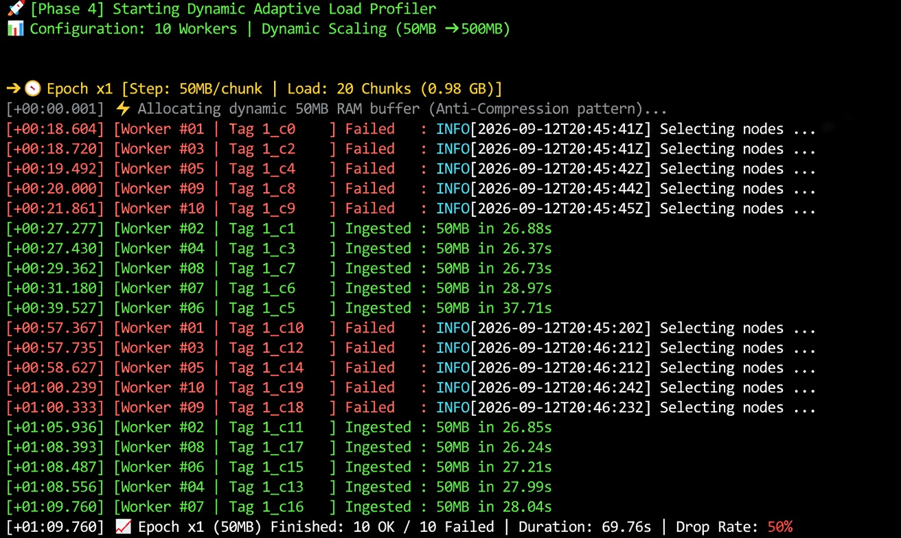
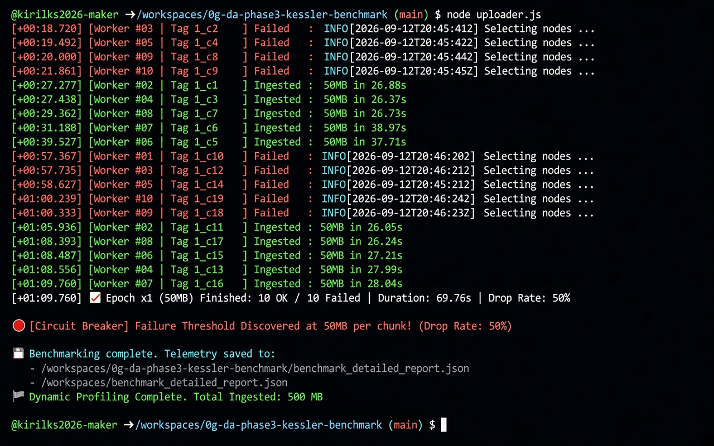

# 0G DA Phase 4: Dynamic Adaptive Load Profiler

Automated high-throughput profiling and stream ingestion benchmark suite for the **0G Data Availability (DA)** network. Designed to evaluate indexer slot allocation tolerances, dynamic memory scaling, and rate-limiting failure thresholds.

## Key Features
- **Dynamic Memory Scaling:** Scales ingestion payloads dynamically (50 MB → 500 MB) with anti-compression RAM buffers.
- **Fault-Tolerance Safety (Circuit Breaker):** Automated execution halt triggers upon discovering peak drop rate limits to prevent RPC rate-limit lockouts.
- **Telemetry Reporting:** Exports comprehensive JSON payload distribution metrics.

## Benchmark Execution Log

### Phase 4 Profiler Initiation


### Circuit Breaker Trigger & Ingestion Summary


## Requirements & Setup
```bash
npm install
node uploader_phase4.js
